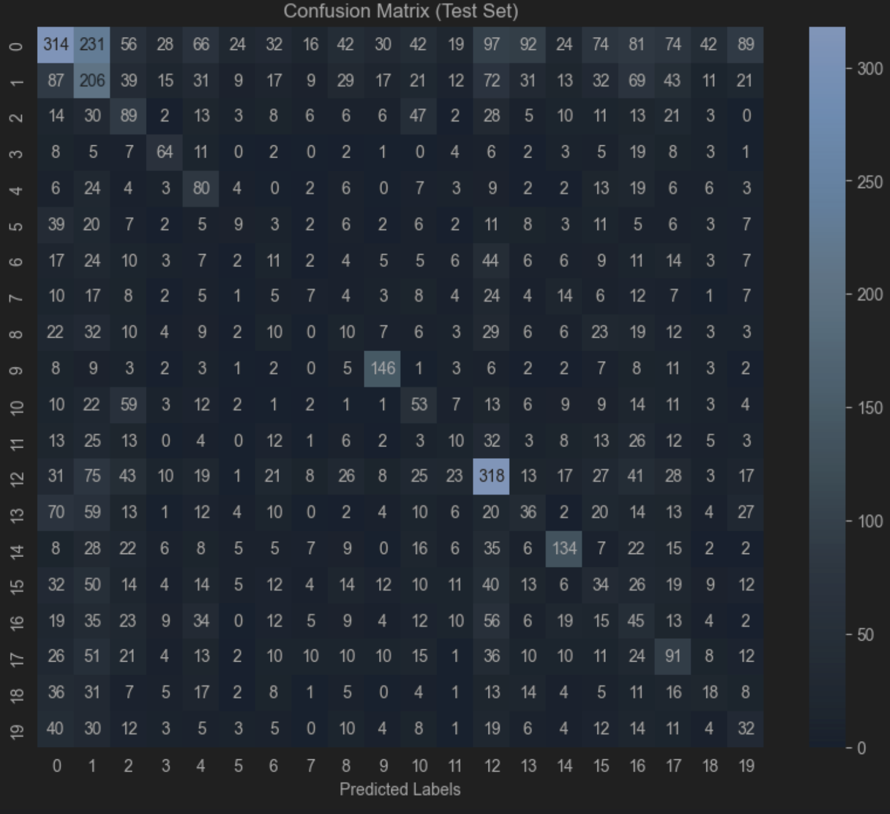

# Tweet Emoji Classification 

## The task
With this project we aim to produce a minimum viable product that serves as the baseline 
for a classification model. The exact task of the model is to read a Tweet and predict an emoji that fits it.
## Running the script

The script for the model used for this MVP can be found in tests/data and is called MVP.ipynb. Running the script might
take a little while, but will show an accuracy of about 24% can be achieved using the current setup.

## Our model

**1. A short description of what you’ve already implemented. This helps your TA assess
whether things are on track.**

At first, we intended to use a linear regression model for the MVP, but after consideration, we decided to 
implement a variation of a Support Vector Machine. What we ended up using is a Support Vector Classifier (SVC),
with a non-linear Radial Basis Function kernel. From our intitial data exploration we observed that the boundaries between the 
classes was not linear when projected into lower dimensional space using PCA. From this we figured that probably some non-linear
kernel was needed to deal with this non-linearity. After some quick try-outs, the RBF kernel improves the performance of the model
significantly. However, we are aware that this specific kernel with the current settings is probably not optimal. It does show
that indeed some non-linear kernel is needed to properly be able to classify the data when using the SVM.

The first step we took was to load the data and create a train-validation-test split.
We, then, converted the text data to numerical features using TF-IDF using the TdIdf vectorizer, which also acts as our preprocessing pipeline.
After the data was preprocessed, the SVC was trained and predictions were generated.

In order to assess the model performance, we generated a classification report which provides metrics such as accuracy, F1 score, precision and recall.

A confusion matrix was also created so that we could assess which features were predicted by the model and what exactly leads us to get the specific accuracy we got. 
From the confusion matrix one can also see whether the model just learns to distinguish between one  or two classes and everything else, or whether it actually
is capable of distinguishing between multiple classes.

**2. Evidence that you achieve above random guessing model performance on your
validation data. This can be your validation accuracy vs. random guess accuracy.**

Out data set contains 20 emojis (labels), therefore we are performing a multi-class classification.
Having 20 classes means that a model random guessing would produce an accuracy of 0.05, but since our 
most prominent feature makes up for 20% of the data, we will consider random guessing to be an accuracy of 20%.
That is because if the model was to only predict that label all the time, it would get an accuracy of 20%. 

As can be seen in our classification report, our testing accuracy is 24% which we consider better than random guessing.
Furthermore, from the diagonal in the confusion matrix we can clearly see that the model learned to identify multiple classes.
It seems to have a harder time classifying the classes that are less frequent in the data-set, but can distinguish between
some of the more frequent classes. If markdown is working properly, the confusion matrix can be found below. If not, it can be found 
either in the repository or by running the MVP.ipynb script.

**3. An outline of what you’re still planning to do. This helps your TA assess whether things
are on track.**

We want to experiment with word embedding over TF-IDF as we suspect that the vectors are then better at capturing semantic meaning, 
which could lead to an increase in accuracy.
Furthermore, we would like to generate more data for the not-so frequent classes to deal with the class imbalance.
One of the other things we want to figure out is the correct kernel to use.

**4. A way for your TA to access your github repo (important!). This can be a link if your
repository is public (recommended), or you can add your TA’s github account as a
collaborator. Make sure this actually works. You can also arrange this with your TA
before the deadline!**

**5. A short statement describing what each team member has contributed.**
Cristina:
Jakub:
Remco: Figuring out parameter settings, documentation writing
